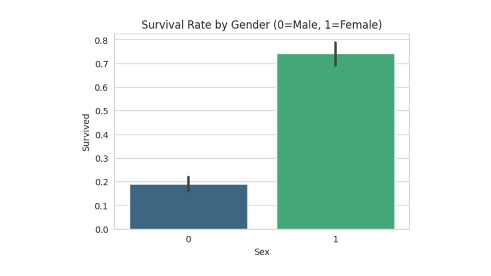
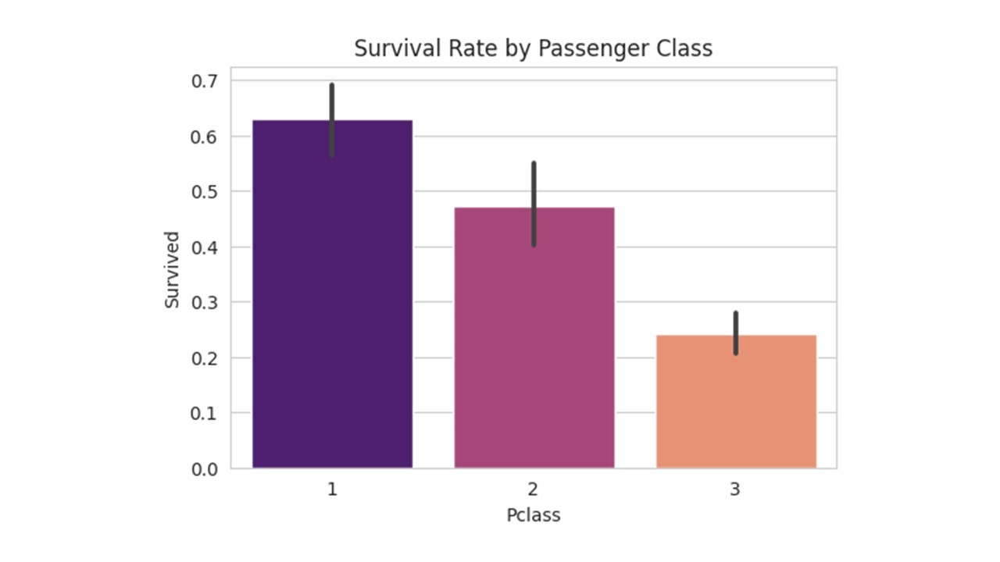
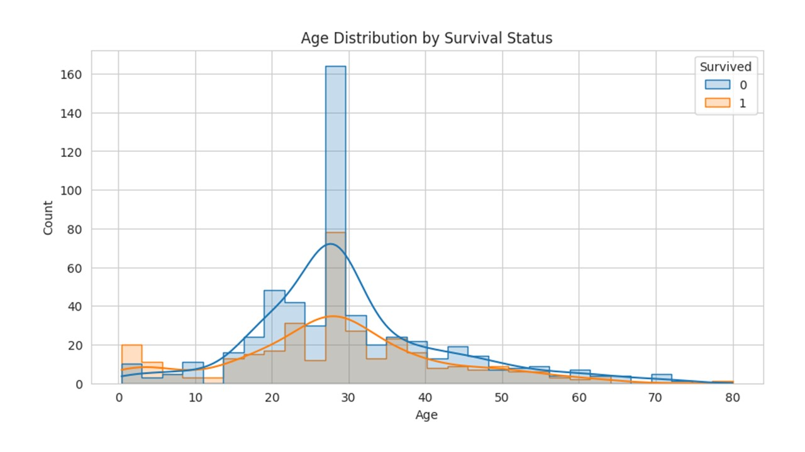
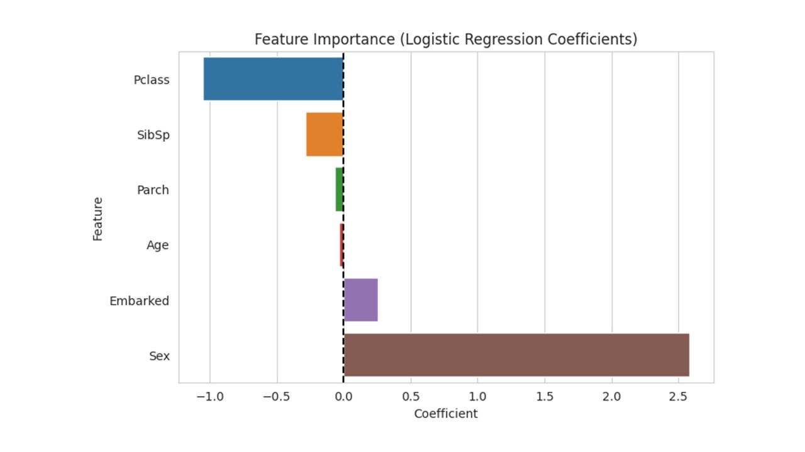

# Kaggle-Titanic-Project
An In-Depth Analysis of Passenger Demographics and Class.

# 🚢 Data Analysis Portfolio: Titanic Survival Factors

## Project Overview

This project uses Exploratory Data Analysis (EDA) and Logistic Regression to investigate the factors that determined a passenger's survival during the sinking of the RMS Titanic in 1912. The goal is to identify and quantify the most influential features.

**Repository Contents:**
* `titanic-decoding-survival.ipynb`: The complete Python Jupyter Notebook.
* `train.csv`: data used.

## 📊 Key Findings from Exploratory Data Analysis (EDA)

The analysis focused on three primary demographic and socio-economic variables: Gender, Passenger Class, and Age.

---

### 1. The Dominance of Gender

**Observation:** Gender (Sex) was the most significant factor affecting survival, strongly supporting the "women and children first" protocol.

* Females (coded as 1) had a survival rate approaching 75%.
* Males (coded as 0) had a survival rate of less than 20%.

---

### 2. The Influence of Passenger Class (Socio-Economic Status)

**Observation:** Survival rates dropped dramatically as the Passenger Class number increased (i.e., moving from 1st to 3rd Class).

* **1st Class (1):** Over 60% survival rate.
* **3rd Class (3):** Approximately 25% survival rate.

This suggests that status and the location of cabins relative to the lifeboats played a critical role.

---

### 3. Age Distribution and Prioritization

**Observation:** While non-survival peaked among young adults (20-30s), the distribution for survivors shows a clear spike among the very young, confirming prioritization of children.

The distribution plot below shows the density of ages for those who did not survive (0) and those who did (1).

---

## 📈 Model-Based Feature Importance

A **Logistic Regression Model** was built to numerically quantify the influence of each feature on the survival outcome. The coefficient values indicate the strength and direction of the relationship.

**Key Findings from Coefficients:**

* **Sex:** Largest positive coefficient, confirming it as the strongest predictor of survival (Female bias).
* **Pclass:** Largest negative coefficient, confirming that being in a higher numbered class (3rd Class) significantly decreased the odds of survival.
* **Age, SibSp, Parch:** These factors have coefficients much closer to zero, indicating a smaller, secondary impact compared to Sex and Pclass.

---

## 💡 Conclusion and Next Steps

### Conclusion

Survival on the Titanic was overwhelmingly determined by **Gender** and **Passenger Class**, reflecting the social hierarchies and emergency protocols enforced during the disaster. The model validates that being a **First Class Female** offered the highest probability of survival.

### Next Steps

To improve model accuracy and further explore latent relationships, future work will include:

1.  **Feature Engineering:** Extracting titles (`Mr.`, `Mrs.`, `Master.`) from the Name feature for more granular age/status insights.
2.  **Model Comparison:** Implementing and comparing results from more complex algorithms like **Random Forests** or **Gradient Boosting Machines (GBM)**.
3.  **Family Analysis:** Creating a composite `FamilySize` feature to better understand if traveling alone or in a large group was detrimental.
